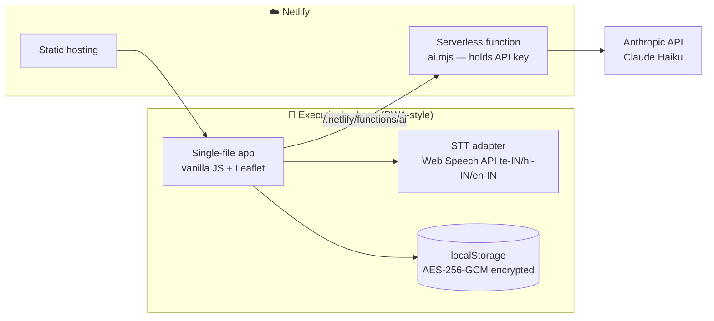

# SiteTracker — Never Miss an Order 🏗️

A field-sales intelligence app for building-materials suppliers. Construction projects buy materials in predictable waves over 3–7 years — cement at foundation, pipes at rough-in, tiles at flooring, sanitaryware at fittings. SiteTracker maps every construction site in the territory, models which materials each site needs **at its current stage**, and turns the map red where an order is about to be placed. Open the app in the morning; the pulsating dots are today's revenue.

> Built for a real building-materials business in India, where field notes arrive in Telugu, Hindi, English — or all three in one sentence.

## Why it exists

Two failure modes kill distributor revenue: **missed timing** (nobody visited the site the week the purchase manager chose a tile brand) and **lost memory** (the executive who knew the site quit, and the relationship left with them). SiteTracker attacks both: stage-aware alerts for timing, and a structured, per-site record — contacts, brand preferences, visit history, quotations, invoices — that survives any staff change.

## Features

**Field operations**
- 🗺️ Live map (Leaflet + OpenStreetMap) with stage-aware alerts — red pulse = material needed *now* and not yet won; amber = next stage approaching or follow-up due
- 📍 GPS site capture, pin-drop fallback, one-tap Google Maps navigation
- 🎙️ **Voice visit notes in Telugu / Hindi / English** (Web Speech API)
- ✨ **AI auto-fill** — Claude parses the dictated note (any language, code-switched) and updates stage, brand preferences, competitor intel and follow-up date in one tap
- 💬 One-tap WhatsApp with a pre-written pitch to the site's purchase manager; shareable daily action list

**Sales intelligence**
- 🧠 Stage-triggered brand-preference capture, one stage *before* each purchase decision (tiles asked at floor-prep, paint at tiling, sinks at painting)
- 📊 Admin analytics generated from field data: *"70% of sites prefer Astral for plumbing"*, *"60% of sanitaryware losses went to Grohe"*, top builders by order value, revenue by category
- 🤖 AI morning briefing — which site to visit first, what to carry, which competitor to counter
- 🏆 Gamified executive dashboard: points, levels (Rookie → Legend), pipeline, win rate, team leaderboard

**Accountability**
- Per-project activity trail: samples requested/sent, quotations (₹), orders won (₹), invoices (₹), losses — every entry stamped with executive name and date

## Architecture

**Design decisions worth noting**

- **Offline-first, zero backend for data.** Site records never leave the device. The hosted URL serves only the app shell — a competitor visiting it sees an empty setup screen.
- **Real encryption at rest.** AES-256-GCM via WebCrypto; key derived from the user's PIN with PBKDF2 (150k iterations, per-device salt). A stolen phone or copied browser profile yields ciphertext. Wrong PIN reveals nothing (GCM auth failure — no oracle).
- **Encrypted, passphrase-protected backups** power the sync/handover model: executives export after field days; the owner imports all backups to get the full territory picture, leaderboard and analytics. Merge is idempotent (by record id + updated-at).
- **Keys never touch the browser.** All AI calls go through a Netlify function; `ANTHROPIC_API_KEY` lives in server environment variables only.
- **Swappable STT provider.** Speech input is isolated behind a small adapter — currently the free browser Web Speech API; designed to swap to [TwinMind Ear-3](https://twinmind.com/transcribe) (5.26% WER, 140+ languages, $0.23/hr) when its public API opens, without touching product code.

## Getting started

1. **Deploy:** fork/clone → connect the repo to [Netlify](https://netlify.com) (no build command; publish directory = root). Or drag the folder onto Netlify Drop.
2. **Enable AI (optional):** add `ANTHROPIC_API_KEY` in Netlify → Site configuration → Environment variables, then redeploy. The app works fully without it — the ✨ buttons simply explain what's missing.
3. **Open the URL on a phone** → Add to Home Screen → set name, role (Executive/Admin) and PIN. Load sample data from the Data tab to explore.

## Security model (honest version)

Protects against: lost/stolen devices, leaked backup files, casual snooping, competitor access to the hosted URL.
Does **not** protect against: a legitimately logged-in user photographing their own screen, or forgotten PINs (by design — there is no recovery, that's the point).
For centrally-enforced per-user access control and remote revocation, the roadmap is a thin Supabase/Firebase auth layer — the client is already structured for it.

## Roadmap

- [ ] TwinMind Ear-3 STT adapter (waitlisted)
- [ ] WhatsApp Business API push alerts (currently one-tap composed messages)
- [ ] Central sync backend with role-based access (Supabase)
- [ ] Photo → stage estimation

## Stack

Vanilla JS · Leaflet 1.9 · WebCrypto (AES-GCM/PBKDF2) · Web Speech API · Netlify Functions · Anthropic Claude

---

*Single HTML file. No framework. No build step. Encrypted by default. Field-tested in Telugu.*
